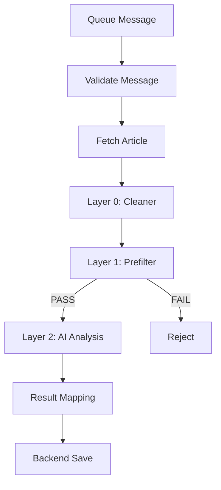

# README Best Practices

This document outlines best practices for creating high-quality README files for different module types.

## Universal Best Practices

### 1. Clear and Descriptive Title

**Good:**
```markdown
# tb-news-ai-analyzer

Cloudflare Worker for AI-powered news article analysis and event extraction.
```

**Bad:**
```markdown
# Module

This module does stuff.
```

**Guidelines:**
- Use the exact module name as the title
- Include a brief, descriptive subtitle
- Avoid vague descriptions like "does stuff" or "handles things"

### 2. Comprehensive Overview

**Include:**
- What the module does
- Why it exists
- Main functionality
- Key features
- Context within the larger system

**Example:**
```markdown
## Overview

`tb-news-ai-analyzer` is a Cloudflare queue consumer that implements a multi-layer processing pipeline for news article analysis. It receives raw article data from the `tb-news-raw-article-saved` queue, processes it through cleaning, filtering, and AI analysis layers, and saves the extracted events to the TokenBel backend.

The worker is part of the TokenBel news processing pipeline and is responsible for transforming raw news content into structured event data.
```

### 3. Consistent Structure

**Recommended Section Order:**
1. Title
2. Overview
3. Features
4. Installation/Setup
5. Configuration
6. Usage
7. API/Interface
8. Architecture
9. Dependencies
10. Testing
11. Deployment
12. Project Structure
13. Related Modules
14. Version History

**Adapt as needed:** Remove irrelevant sections, add domain-specific ones.

### 4. Use of Code Examples

**Good:**
```markdown
## Usage

### Basic Usage

```typescript
import { analyzeArticle } from './tb-news-ai-analyzer';

const result = await analyzeArticle({
  id: 12345,
  content: 'Article text...',
  source: 'news-site.com'
});
```
```

**Bad:**
```markdown
## Usage

Call the analyze function with article data.
```

**Guidelines:**
- Include at least one code example
- Show both basic and advanced usage
- Use the actual language of the module
- Keep examples concise but complete

### 5. Documentation of All Public Interfaces

**For Functions:**
```markdown
### analyzeArticle(options)

Analyzes a news article and extracts events.

**Parameters:**
- `options` (object): Analysis options
  - `id` (number, required): Article ID
  - `content` (string, required): Article content
  - `source` (string): Article source URL
  - `maxLength` (number): Maximum content length to process (default: 50000)

**Returns:**
- `Promise<AnalysisResult>`: Analysis results with extracted events

**Throws:**
- `ValidationError`: If required parameters are missing
- `AnalysisError`: If AI analysis fails
```

**Guidelines:**
- Document all exported functions, classes, and types
- Include parameter types and descriptions
- Document return types and possible errors
- Mark required vs optional parameters

### 6. Visual Documentation

**Use Mermaid Diagrams for:**
- Complex workflows
- Data flow between components
- State machines
- Decision trees
- Architecture diagrams

**Example:**


**Guidelines:**
- Use diagrams for complex logic
- Keep diagrams simple and readable
- Include a brief description before the diagram
- Use consistent styling

### 7. Configuration Documentation

**Good:**
```markdown
## Configuration

### Environment Variables

| Variable | Default | Description | Required |
|----------|---------|-------------|----------|
| `API_DOMAIN` | `https://dashboard.tokenbel.info` | Backend API base URL | Yes |
| `MISTRAL_API_KEY` | (secret) | Mistral AI API key | Yes |
| `MISTRAL_CHAT_MODEL` | `mistral-small-latest` | Mistral model to use | No |
| `MISTRAL_CHAT_TIMEOUT_MS` | `120000` | Mistral request timeout in ms | No |

### wrangler.toml

```toml
[[queues.consumers]]
queue = "tb-news-raw-article-saved"
max_batch_size = 1
max_retries = 3

[[secrets_store_secrets]]
binding = "TB_API_TOKEN"
store_id = "..."
secret_name = "TBel-API-Token"

[vars]
API_DOMAIN = "https://dashboard.tokenbel.info"
```
```

**Guidelines:**
- Document all configuration options
- Include defaults and whether they're required
- Show example configuration files
- Group related configuration together

### 8. Error Handling Documentation

**Good:**
```markdown
## Error Handling

### Retryable Errors

The following errors are considered retryable and will trigger automatic retries:

- **Network errors**: Connection failures to external services
- **Timeout errors**: Request timeouts (up to 3 retries)
- **Rate limit errors**: Temporary rate limiting from AI providers

### Non-Retryable Errors

The following errors are not retried:

- **Validation errors**: Invalid message format or missing required fields
- **Authentication errors**: Invalid API keys or tokens
- **Business logic errors**: Invalid data that cannot be processed

### Error Recording

All processing failures are recorded in the backend with the following payload:

```typescript
interface ProcessingFailurePayload {
  messageId: string;
  errorType: string;
  errorMessage: string;
  stackTrace?: string;
  context?: Record<string, unknown>;
  timestamp: string;
}
```
```

**Guidelines:**
- Distinguish between retryable and non-retryable errors
- Document error payloads
- Include error handling examples
- Explain error recovery strategies

## Type-Specific Best Practices

### Cloudflare Workers

#### 1. Document Queue Bindings

```markdown
## Service Bindings

### Cloudflare Infrastructure

| Binding Type | Name | Purpose |
|-------------|------|---------|
| Queue Consumer | `tb-news-raw-article-saved` | Trigger: receives messages to process |
| Queue Producer | `tb-news-ai-analysis-completed` | Output: sends processed results |
| Secret Store | `TB_API_TOKEN` | Backend API authentication |
| KV Namespace | `TB_CACHE` | Caching layer for repeated requests |
```

#### 2. Document Message Contracts

```markdown
## Queue Message Contracts

### Input Message

```typescript
interface RawArticleSavedMessage {
  version: 'v1';
  messageId: string;
  timestamp: string;
  payload: {
    articleId: number;
    sourceId: number;
    url: string;
    title: string;
    contentHash: string;
    publishedAt: string;
  };
}
```

### Output Message

```typescript
interface AiAnalysisCompletedMessage {
  version: 'v1';
  messageId: string;
  correlationId: string;
  timestamp: string;
  payload: {
    articleId: number;
    events: Event[];
    analysis: AnalysisResult;
    processingTimeMs: number;
  };
}
```
```

#### 3. Document Business Logic Layers

```markdown
## Business Logic

### Message Flow

1. **Queue Trigger**: Consumes messages from `tb-news-raw-article-saved` queue
2. **Message Validation**: Validates message shape, version, and required fields
3. **Env Validation**: Resolves secrets, validates required environment variables
4. **Data Fetch**: Retrieves full article content from backend API
5. **Layer 0 Processing**: Initial data cleaning and normalization
6. **Layer 1 Processing**: Rule-based filtering and relevance scoring
7. **Layer 2 Processing**: AI-powered analysis and event extraction
8. **Result Mapping**: Normalizes and prepares results for backend
9. **Backend Save**: Persists results to TokenBel backend

### Layer 0: Cleaner

- **Purpose**: Normalize and clean raw article text
- **Input**: Raw article content from backend API
- **Output**: Cleaned text ready for analysis
- **Key Operations**:
  - Unicode normalization (NFC)
  - Invisible character removal
  - Whitespace normalization
  - Text encoding validation
```

#### 4. Document AI Configuration

```markdown
### AI Model & Prompts

- **Provider**: Mistral AI
- **Model**: `mistral-small-latest` (configurable via `MISTRAL_CHAT_MODEL`)
- **Timeout**: 120000ms (2 minutes, configurable via `MISTRAL_CHAT_TIMEOUT_MS`)
- **Temperature**: 0.1 (low for deterministic output)
- **Response Format**: JSON mode for structured output

#### Prompts

**Primary Analysis Prompt (v5):**
```
You are an expert news analyst. Extract all significant events from the following news article...
```

**Fallback Prompt (v4):**
```
Analyze the following news article and identify key events...
```
```

#### 5. Include Performance Considerations

```markdown
## Performance Considerations

### Cost Optimization

- **Gating**: Only proceed to AI analysis if Layer 1 prefilter passes (relevance >= 0.65)
- **Content Limitation**: Truncate article content to `ARTICLE_TEXT_MAX_CHARS` (default: 50000)
- **Batching**: Process messages individually (max_batch_size = 1) to avoid mixing
- **Caching**: Use KV namespace to cache repeated requests

### Processing Optimization

- **Parallel Processing**: Non-blocking I/O for external API calls
- **Memory Management**: Stream large responses to avoid memory issues
- **Timeout Management**: Set appropriate timeouts for external services
```

### Node.js/TypeScript Modules

#### 1. Document Exports

```markdown
## API Reference

### Exported Functions

#### `processData(data, options?)`

Processes input data according to module logic.

**Parameters:**
- `data` (unknown, required): Input data to process
- `options` (ProcessOptions, optional): Processing options

**Returns:**
- `Promise<ProcessedData>`: Processed data result

**Example:**
```typescript
import { processData } from './data-processor';

const result = await processData(
  { id: 1, content: '...' },
  { normalize: true, validate: true }
);
```

#### `validateData(data, schema)`

Validates data against a schema.

**Parameters:**
- `data` (unknown, required): Data to validate
- `schema` (ZodSchema, required): Validation schema

**Returns:**
- `ValidationResult`: Validation result with errors if any

**Throws:**
- `ValidationError`: If validation fails and throwOnError is true
```

#### 2. Document Types

```markdown
## Types

### Core Types

```typescript
interface ProcessOptions {
  normalize?: boolean;
  validate?: boolean;
  strict?: boolean;
  maxDepth?: number;
}

interface ProcessedData {
  id: string;
  content: string;
  metadata: Record<string, unknown>;
  processedAt: string;
  errors?: string[];
}

interface ValidationResult {
  valid: boolean;
  errors?: ValidationError[];
  data?: unknown;
}
```

### Type Guards

```typescript
function isProcessedData(data: unknown): data is ProcessedData {
  return typeof data === 'object' && 
    data !== null && 
    'id' in data && 
    'content' in data;
}
```
```

#### 3. Document Dependencies

```markdown
## Dependencies

### External Dependencies

| Package | Version | Purpose |
|---------|---------|---------|
| `zod` | ^3.22.0 | Schema validation |
| `axios` | ^1.6.0 | HTTP client |
| `lodash` | ^4.17.0 | Utility functions |
| `@tokenbel/common` | ^1.0.0 | Shared utilities |

### Internal Dependencies

- `../utils/logger`: Logging utilities
- `../types/common`: Common type definitions
- `../config`: Configuration management
```

#### 4. Include Usage Examples

```markdown
## Usage

### Basic Usage

```typescript
import { DataProcessor } from './data-processor';

const processor = new DataProcessor();
const result = await processor.process({ id: 1, data: '...' });
```

### With Custom Configuration

```typescript
import { DataProcessor, ProcessOptions } from './data-processor';

const options: ProcessOptions = {
  normalize: true,
  validate: true,
  strict: false,
  maxDepth: 5
};

const processor = new DataProcessor(options);
const result = await processor.process({ id: 1, data: '...' });
```

### Error Handling

```typescript
import { DataProcessor, ValidationError } from './data-processor';

try {
  const result = await processor.process(invalidData);
} catch (error) {
  if (error instanceof ValidationError) {
    console.error('Validation failed:', error.message);
    console.error('Details:', error.details);
  } else {
    console.error('Processing error:', error);
  }
}
```
```

### Python Modules

#### 1. Document with Docstrings

```markdown
## API Reference

### Classes

#### `DataProcessor`

A data processor that handles cleaning, validation, and transformation.

**Attributes:**
- `config` (dict): Configuration dictionary
- `logger` (logging.Logger): Logger instance

**Methods:**

##### `__init__(config=None)`

Initialize the DataProcessor.

**Parameters:**
- `config` (dict, optional): Configuration dictionary. Defaults to None.

##### `process(data, validate=True)`

Process input data.

**Parameters:**
- `data` (dict, required): Input data dictionary
- `validate` (bool, optional): Whether to validate data. Defaults to True.

**Returns:**
- `dict`: Processed data dictionary

**Raises:**
- `ValueError`: If data is invalid and validate is True
- `TypeError`: If data is not a dictionary
```

#### 2. Document Dependencies

```markdown
## Dependencies

### Required Packages

| Package | Version | Purpose |
|---------|---------|---------|
| `requests` | ^2.31.0 | HTTP client |
| `pydantic` | ^2.5.0 | Data validation |
| `numpy` | ^1.24.0 | Numerical operations |
| `pandas` | ^2.0.0 | Data manipulation |

### Optional Dependencies

| Package | Version | Purpose |
|---------|---------|---------|
| `pytest` | ^7.4.0 | Testing framework |
| `mypy` | ^1.7.0 | Type checking |
| `black` | ^23.10.0 | Code formatting |

### Development Dependencies

```toml
[tool.poetry.dev-dependencies]
pytest = "^7.4.0"
pytest-cov = "^4.1.0"
mypy = "^1.7.0"
black = "^23.10.0"
```
```

#### 3. Include Installation Instructions

```markdown
## Installation

### Prerequisites

- Python 3.10+
- pip or poetry

### Using pip

```bash
pip install tokenbel-data-processor
```

### Using poetry

```bash
poetry add tokenbel-data-processor
```

### From source

```bash
git clone https://github.com/Red-Panda-Dev/tbel.git
cd tbel/src/data/processor
python -m pip install -e .
```
```

#### 4. Document Configuration

```markdown
## Configuration

### Environment Variables

| Variable | Default | Description |
|----------|---------|-------------|
| `LOG_LEVEL` | `INFO` | Logging level (DEBUG, INFO, WARNING, ERROR) |
| `MAX_WORKERS` | `4` | Maximum number of worker threads |
| `TIMEOUT_SECONDS` | `30` | Request timeout in seconds |

### Configuration File

Create a `config.yaml` file:

```yaml
logging:
  level: INFO
  format: '%(asctime)s - %(name)s - %(levelname)s - %(message)s'
  file: /var/log/data-processor.log

processing:
  max_workers: 4
  timeout: 30
  retry_attempts: 3

database:
  host: localhost
  port: 5432
  name: processor_db
```

Or use environment variables:

```bash
export LOG_LEVEL=DEBUG
export MAX_WORKERS=8
export TIMEOUT_SECONDS=60
```
```

### Frontend Components

#### 1. Document Props

```markdown
## Props

| Prop | Type | Required | Default | Description |
|------|------|----------|---------|-------------|
| `value` | `string` | Yes | - | The input value for the component |
| `label` | `string` | No | `''` | Label text displayed above the input |
| `disabled` | `boolean` | No | `false` | Whether the input is disabled |
| `required` | `boolean` | No | `false` | Whether the input is required |
| `placeholder` | `string` | No | `''` | Placeholder text when empty |
| `error` | `string \| null` | No | `null` | Error message to display |

**Example:**
```vue
<TextInput
  v-model="username"
  label="Username"
  placeholder="Enter your username"
  :required="true"
  :error="usernameError"
/>
```
```

#### 2. Document Events

```markdown
## Events

| Event | Payload | Description |
|-------|---------|-------------|
| `update:value` | `string` | Emitted when the input value changes |
| `focus` | `FocusEvent` | Emitted when the input receives focus |
| `blur` | `FocusEvent` | Emitted when the input loses focus |
| `input` | `InputEvent` | Emitted on input (for native input events) |

**Example:**
```vue
<TextInput
  v-model="searchQuery"
  @update:value="handleSearch"
  @focus="handleFocus"
  @blur="handleBlur"
/>
```
```

#### 3. Document Slots

```markdown
## Slots

| Slot | Description |
|------|-------------|
| `default` | The main content slot |
| `label` | Custom label content |
| `hint` | Hint text displayed below the input |
| `error` | Custom error message content |
| `prefix` | Content to display before the input |
| `suffix` | Content to display after the input |

**Example:**
```vue
<TextInput v-model="password">
  <template #label>
    <span class="required">Password</span>
  </template>
  <template #prefix>
    <Icon name="lock" />
  </template>
  <template #hint>
    Must be at least 8 characters
  </template>
</TextInput>
```
```

#### 4. Document Styling

```markdown
## Styling

### CSS Variables

```css
--tb-input-bg: #ffffff;
--tb-input-border: 1px solid #e2e8f0;
--tb-input-border-radius: 0.375rem;
--tb-input-padding: 0.5rem 0.75rem;
--tb-input-font-size: 1rem;
--tb-input-color: #1a202c;
--tb-input-placeholder-color: #718096;
--tb-input-focus-border: 1px solid #3182ce;
--tb-input-focus-box-shadow: 0 0 0 1px #3182ce;
--tb-input-error-border: 1px solid #e53e3e;
--tb-input-disabled-bg: #f7fafc;
--tb-input-disabled-border: 1px solid #e2e8f0;
```

### Customizing Styles

```vue
<style>
.custom-input {
  --tb-input-bg: #f8f9fa;
  --tb-input-border: 2px solid #4a5568;
  --tb-input-border-radius: 0.5rem;
}
</style>

<TextInput class="custom-input" v-model="value" />
```

### Class Names

| Class | Description |
|-------|-------------|
| `.tb-input` | Root input element |
| `.tb-input--disabled` | Disabled state |
| `.tb-input--error` | Error state |
| `.tb-input--focus` | Focus state |
| `.tb-input__label` | Label element |
| `.tb-input__hint` | Hint text element |
```
```

#### 5. Include Usage Examples

```markdown
## Usage

### Basic Usage

```vue
<template>
  <TextInput v-model="text" label="Enter text" />
</template>

<script setup>
import { ref } from 'vue';
import TextInput from './TextInput.vue';

const text = ref('');
</script>
```

### With Validation

```vue
<template>
  <TextInput
    v-model="email"
    label="Email"
    type="email"
    placeholder="user@example.com"
    :error="emailError"
    @update:value="validateEmail"
  />
</template>

<script setup>
import { ref } from 'vue';
import TextInput from './TextInput.vue';

const email = ref('');
const emailError = ref(null);

function validateEmail(value) {
  if (!value) {
    emailError.value = 'Email is required';
  } else if (!/^\S+@\S+\.\S+$/.test(value)) {
    emailError.value = 'Invalid email format';
  } else {
    emailError.value = null;
  }
}
</script>
```

### Form Integration

```vue
<template>
  <form @submit.prevent="handleSubmit">
    <TextInput
      v-model="form.username"
      label="Username"
      required
      :error="errors.username"
    />
    <TextInput
      v-model="form.password"
      label="Password"
      type="password"
      required
      :error="errors.password"
    />
    <button type="submit">Submit</button>
  </form>
</template>
```
```

## Documentation Maintenance

### Keeping README Updated

1. **Update on Changes**: Update README whenever module functionality changes
2. **Review Regularly**: Review README during code reviews
3. **Automate**: Use this skill to regenerate README when needed
4. **Version History**: Maintain version history section

### README Quality Checklist

- [ ] Clear, descriptive title
- [ ] Comprehensive overview
- [ ] All public interfaces documented
- [ ] Code examples included
- [ ] Configuration documented
- [ ] Dependencies listed
- [ ] Error handling documented
- [ ] Testing instructions included
- [ ] Related modules linked
- [ ] No broken links
- [ ] Consistent formatting
- [ ] No typos or grammatical errors

### Automated README Generation

Use the Universal README Generator skill by specifying the module directory path.

To regenerate all READMEs:
```bash
find . -name "README.md" -type f -delete
find . -type d | grep -v node_modules | while read dir; do
  # Process each directory
  echo "Processing: $dir"
done
```

### Manual Review Points

1. **Accuracy**: Verify all documented features exist
2. **Completeness**: Check all public APIs are documented
3. **Clarity**: Ensure descriptions are clear and understandable
4. **Consistency**: Verify consistent style and formatting
5. **Relevance**: Remove outdated information
