# Mermaid Syntax Guide for README Diagrams

This guide provides examples and best practices for using Mermaid diagrams in README files.

## Why Use Mermaid?

Mermaid is a JavaScript-based diagramming and charting tool that renders Markdown-inspired text definitions to create and modify diagrams dynamically. It's perfect for documentation because:

- **Text-based**: Diagrams are defined as text, making them version-controllable
- **GitHub Support**: Native support in GitHub Markdown
- **Simple Syntax**: Easy to learn and use
- **Consistent**: Same diagram across all platforms
- **Maintainable**: Update diagrams by editing text

## Basic Syntax

### Flowchart (Most Common)

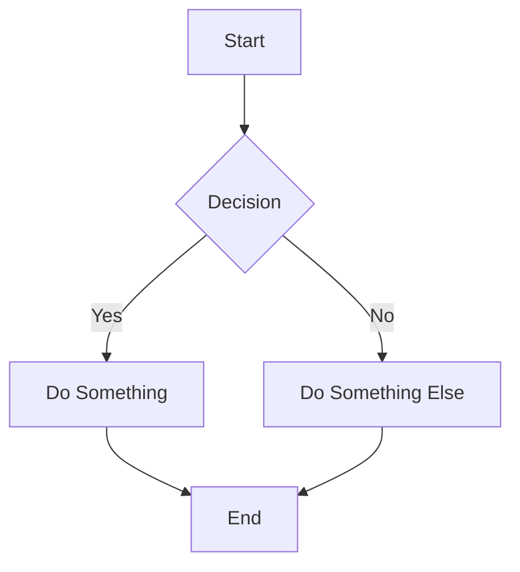

**Key Elements:**
- `flowchart TD` or `flowchart LR` - Top-Down or Left-Right direction
- `A[Text]` - Node with text
- `-->` - Arrow to next node
- `-- Text -->` - Arrow with text label
- `|Text|` - Edge label syntax
- `B{Decision}` - Diamond shape for decisions
- `C(Start)` - Rounded rectangle
- `D[[Subroutine]]` - Subroutine shape
- `E((Database))` - Database shape

### Sequence Diagram

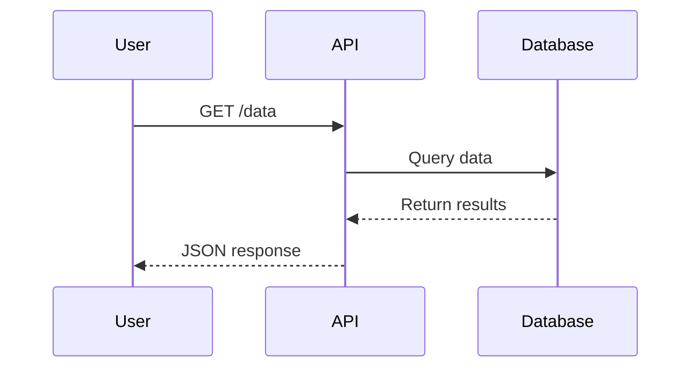

### Class Diagram

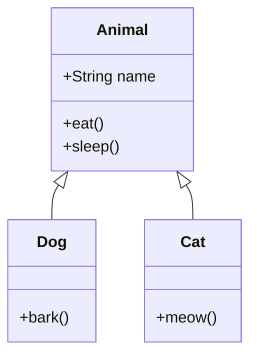

### State Diagram

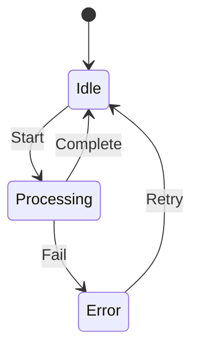

### ER Diagram

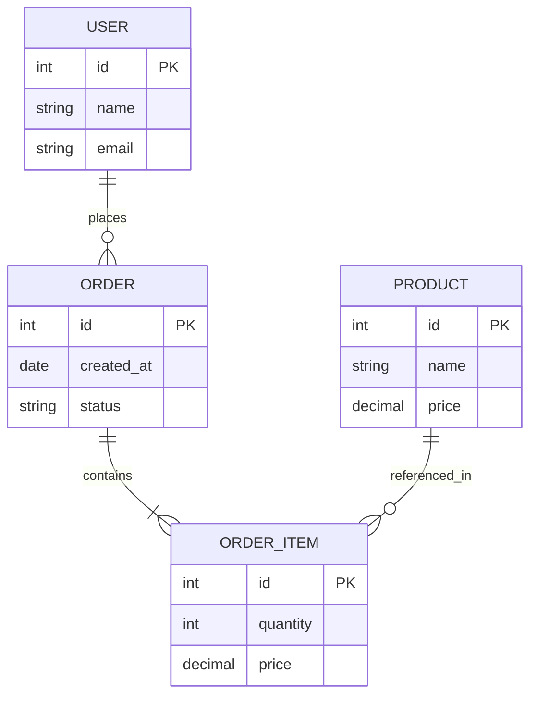

## Cloudflare Worker Diagrams

### Queue Processing Flow

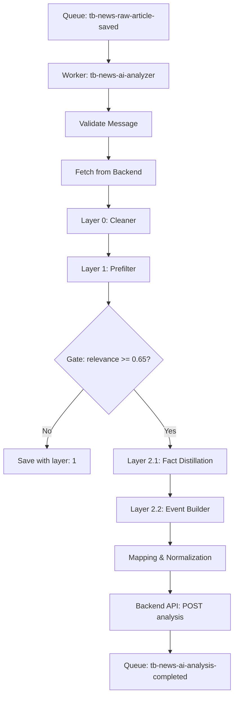

### Service Dependencies

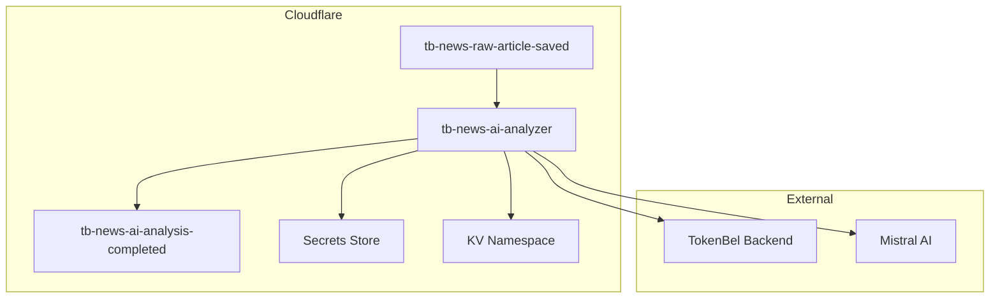

### Data Flow with Error Handling

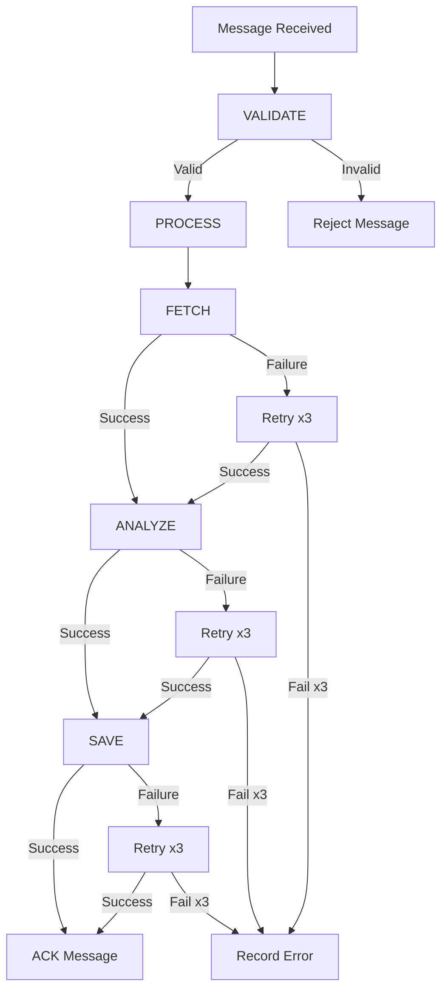

## Node.js/TypeScript Module Diagrams

### Module Dependencies

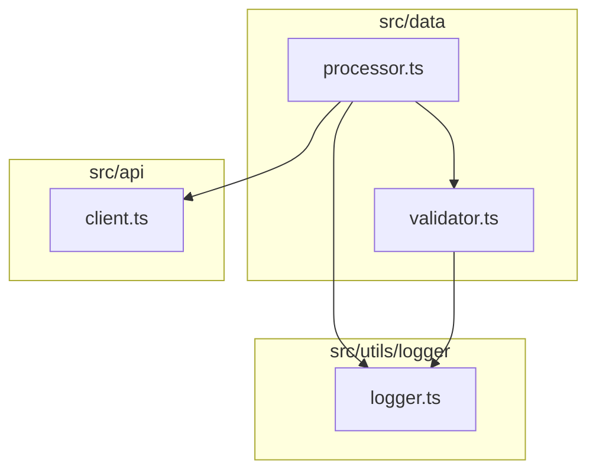

### Function Call Flow

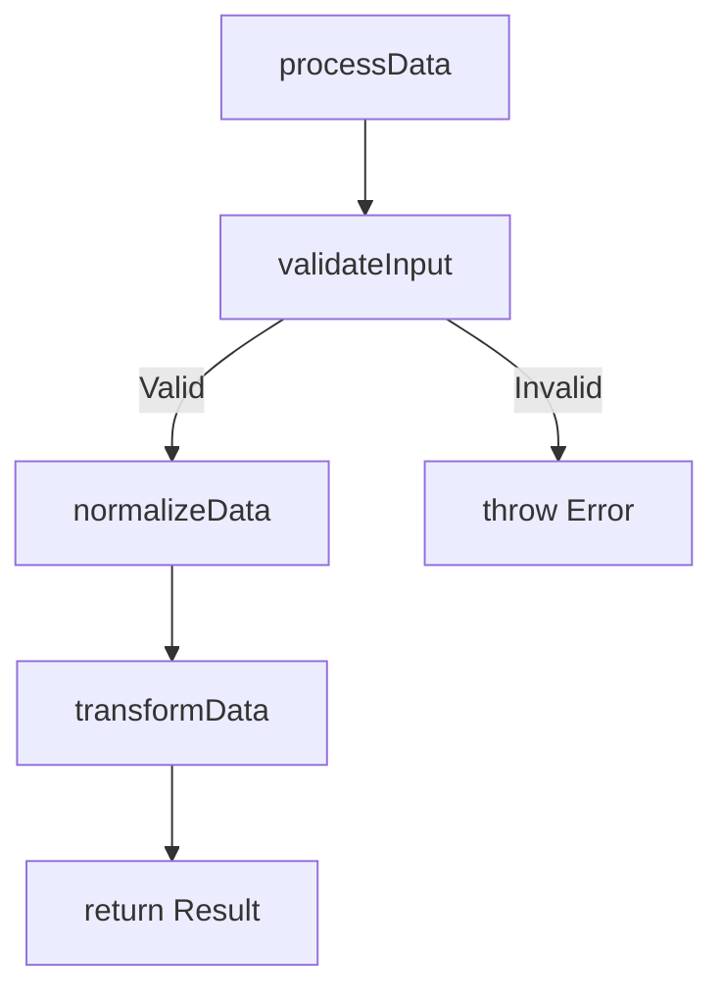

### Class Hierarchy

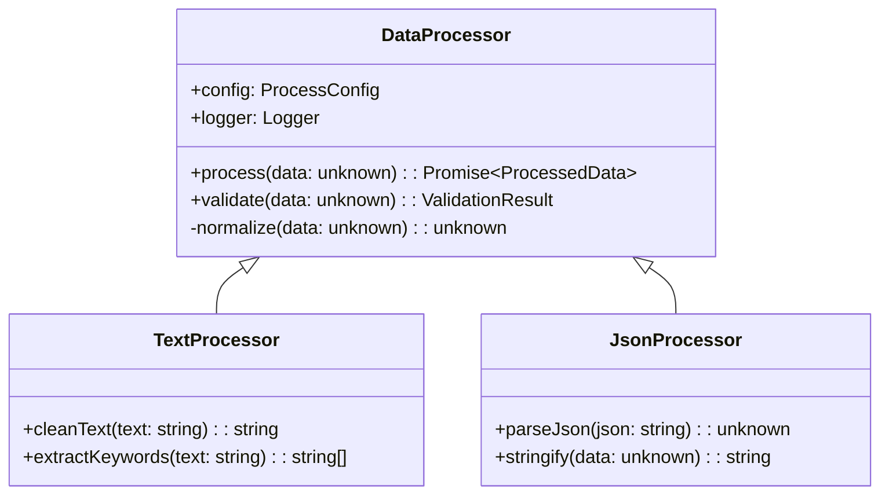

## Python Module Diagrams

### Package Structure

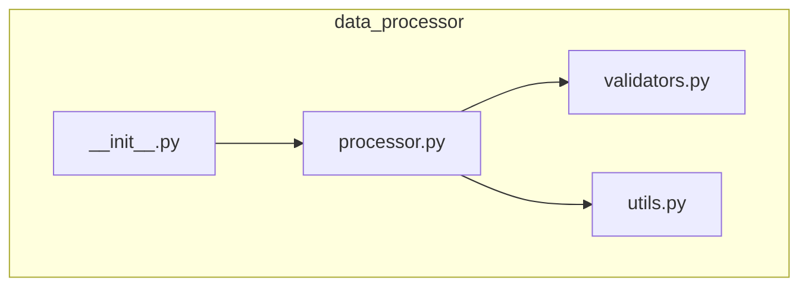

### Data Processing Pipeline

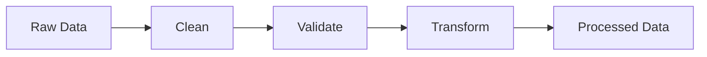

## Frontend Component Diagrams

### Component Hierarchy

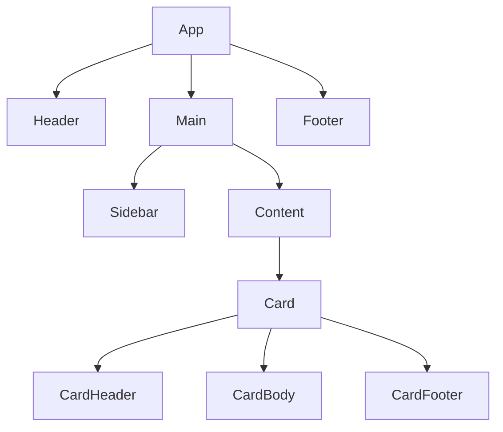

### Component Props Flow

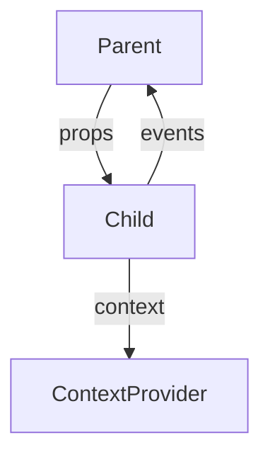

### User Interaction Flow

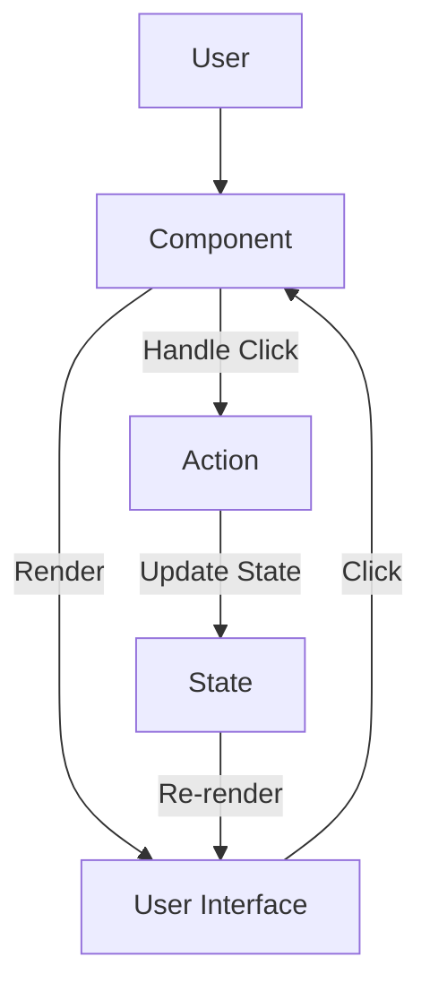

## Complex Diagrams

### Multi-Worker System

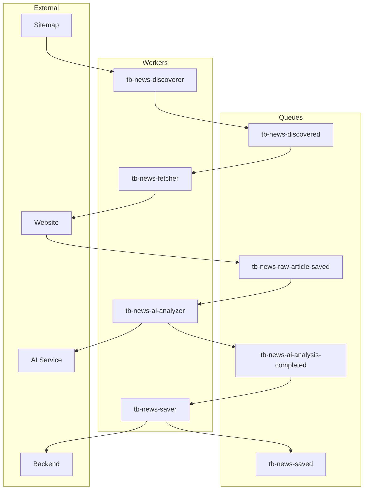

### Decision Tree

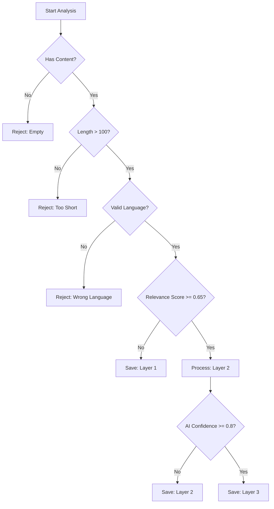

### Error Handling Flow

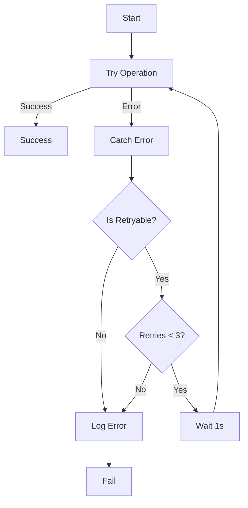

## Styling Diagrams

### Custom Styling

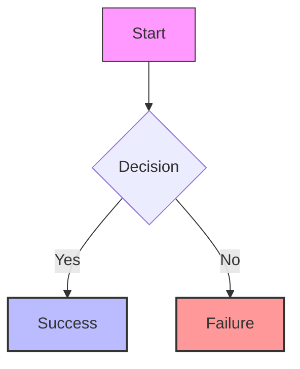

### Class Definitions

```mermaid
flowchart TD
    classDef success fill:#9f9,stroke:#333
    classDef failure fill:#f99,stroke:#333
    classDef decision fill:#ff9,stroke:#333
    
    A[Start] --> B{Decision?}
    B -->|Yes| C[Success]
    B -->|No| D[Failure]
    
    class B decision
    class C success
    class D failure
```

### Themes

```mermaid
%%{init: {'theme': 'base', 'themeVariables': { 'primaryColor': '#ff0000'}}}%%
flowchart TD
    A --> B
```

Available themes: `base`, `forest`, `dark`, `default`, `neutral`

## Best Practices

### 1. Keep It Simple

**Good:**
```mermaid
flowchart TD
    A --> B --> C
```

**Bad:**
```mermaid
flowchart TD
    A1[Very Long Node Name That Makes The Diagram Hard To Read] --> B2[Another Very Long Node Name]
    B2 --> C3[Yet Another Extremely Long Node Name With Too Much Text]
```

### 2. Use Descriptive Node Names

**Good:**
```mermaid
flowchart TD
    Fetch[Fetch Article] --> Clean[Clean Text]
```

**Bad:**
```mermaid
flowchart TD
    A --> B
```

### 3. Limit Diagram Size

- Maximum 10-15 nodes for readability
- Break complex flows into multiple diagrams
- Use subgraphs to group related nodes

### 4. Use Consistent Direction

- Use `TD` (Top-Down) for most flows
- Use `LR` (Left-Right) for sequences
- Be consistent within a document

### 5. Add Descriptions

Always include a brief description before the diagram:

```markdown
### Data Processing Pipeline

The following diagram shows how data flows through the processing layers:

```mermaid
flowchart TD
    Input --> Layer0 --> Layer1 --> Layer2 --> Output
```
```

### 6. Test Diagrams

Always test your Mermaid diagrams:
1. View in GitHub to ensure rendering
2. Check on different devices
3. Verify all syntax is correct

## Common Mistakes

### 1. Syntax Errors

**Wrong:**
```mermaid
flowchart TD
    A -> B  # Wrong arrow syntax
```

**Correct:**
```mermaid
flowchart TD
    A --> B  # Correct arrow syntax
```

### 2. Missing Direction

**Wrong:**
```mermaid
flowchart
    A --> B  # Missing direction (TD or LR)
```

**Correct:**
```mermaid
flowchart TD
    A --> B  # With direction
```

### 3. Special Characters

**Wrong:**
```mermaid
flowchart TD
    A[Node with "quotes"] --> B
```

**Correct:**
```mermaid
flowchart TD
    A[Node with quotes] --> B
    # or
    A["Node with 'single quotes'"] --> B
```

### 4. Line Breaks in Nodes

**Wrong:**
```mermaid
flowchart TD
    A[Line 1
    Line 2] --> B  # Literal newline
```

**Correct:**
```mermaid
flowchart TD
    A["Line 1<br>Line 2"] --> B  # HTML line break
```

## Tools for Creating Mermaid Diagrams

### Online Editors
- [Mermaid Live Editor](https://mermaid.live/) - Official live editor
- [Mermaid Chart](https://www.mermaidchart.com/) - Advanced editor
- [Draw.io with Mermaid](https://app.diagrams.net/) - Import/export Mermaid

### VS Code Extensions
- [Mermaid Preview](https://marketplace.visualstudio.com/items?itemName=bierner.markdown-mermaid) - Preview Mermaid in VS Code
- [Markdown Preview Mermaid Support](https://marketplace.visualstudio.com/items?itemName=bierner.markdown-mermaid) - Mermaid support for markdown preview

### CLI Tools
- [mermaid-cli](https://github.com/mermaid-js/mermaid-cli) - Generate diagrams from command line
- [mmdc](https://github.com/mermaid-js/mermaid-cli/tree/master/packages/mermaid-cli) - Mermaid CLI

## Advanced Examples

### Interactive Diagram (GitHub only)

```mermaid
flowchart TD
    A[Start] --> B{Decision}
    B -->|Yes| C[Success]
    B -->|No| D[Failure]
    click A "https://example.com/start" _blank
    click C "https://example.com/success" _blank
```

### Complex Subgraphs

```mermaid
flowchart TD
    subgraph Input
        A1[Source 1]
        A2[Source 2]
        A3[Source 3]
    end
    
    subgraph Processing
        B1[Processor 1]
        B2[Processor 2]
    end
    
    subgraph Output
        C1[Destination 1]
        C2[Destination 2]
    end
    
    A1 --> B1
    A2 --> B1
    A3 --> B2
    B1 --> C1
    B2 --> C2
```

### Custom Shapes

```mermaid
flowchart TD
    A([Start]) --> B{{Decision}}
    B -->|Yes| C[/Input/]
    B -->|No| D(\Output\)
    C --> E((Database))
    D --> F[[Subroutine]]
```

Available shapes:
- `[` `]` - Rectangle (default)
- `(` `)` - Circle
- `(` `)` - Rounded rectangle (subroutine)
- `{` `}` - Diamond (decision)
- `[/` `/]` - Hexagon
- `[[` `]]` - Subroutine
- `((` `))` - Cylinder (database)
- `>` `]` - Right arrow
- `<` `[` - Left arrow
- `<>` `>` - Double arrow

## References

- [Mermaid Official Documentation](https://mermaid.js.org/)
- [Mermaid Syntax Reference](https://mermaid.js.org/syntax/flowchart.html)
- [GitHub Mermaid Support](https://docs.github.com/en/get-started/writing-on-github/working-with-advanced-formatting/creating-diagrams)
- [Mermaid Live Editor](https://mermaid.live/)
