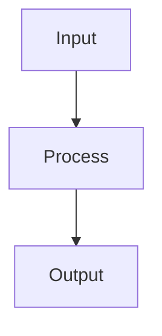

# Documentation Standards

This document defines the documentation standards for README files generated by the Universal README Generator skill.

## General Standards

### File Naming

- **README files**: Must be named `README.md` (uppercase)
- **Case sensitivity**: Use lowercase for module names in paths
- **Extensions**: Always use `.md` extension for Markdown files

### File Location

- **Root level**: Every module directory should have a `README.md`
- **No nesting**: README files should not be nested in subdirectories
- **Exception**: Sub-modules may have their own README files

### File Encoding

- **Encoding**: UTF-8
- **Line endings**: LF (Unix-style)
- **BOM**: No byte order mark

## Content Standards

### Language

- **Primary language**: English
- **Technical terms**: Use standard industry terminology
- **Consistency**: Use consistent terminology throughout

### Formatting

- **Line length**: Maximum 120 characters per line
- **Paragraphs**: Separate paragraphs with blank lines
- **Headings**: Use ATX-style headings (`#`, `##`, etc.)
- **Emphasis**: Use `**bold**` for important terms, `_italic_` for emphasis

### Code Formatting

- **Code blocks**: Use triple backticks with language specification
- **Indentation**: Use 2 or 4 spaces (consistent within a file)
- **Line breaks**: Break long lines in code blocks
- **Syntax highlighting**: Always specify language for code blocks

**Good:**
````markdown
```typescript
function example(param: string): void {
  console.log(param);
}
```
````

**Bad:**
````markdown
    function example(param) {
      console.log(param);
    }
````

## Structure Standards

### Heading Hierarchy

```markdown
# Main Title (H1) - Module name

## Section (H2) - Major sections

### Subsection (H3) - Subsections

#### Sub-subsection (H4) - Detailed subsections
```

**Rules:**
- Only one H1 per file (the module name)
- Use sequential heading levels (don't skip from H2 to H4)
- Don't use H5 or H6 (too deep)

### Section Order

**Recommended order for most modules:**

1. `# {Module Name}` - Title
2. `{Description}` - Brief description under title
3. `## Overview` - Detailed overview
4. `## Features` - Key features
5. `## Installation` or `## Setup` - Setup instructions
6. `## Configuration` - Configuration options
7. `## Usage` - Usage examples
8. `## API Reference` or `## Interface` - API documentation
9. `## Architecture` - Architecture overview
10. `## Dependencies` - Dependencies
11. `## Testing` - Testing information
12. `## Deployment` - Deployment instructions
13. `## Project Structure` - File structure
14. `## Related Modules` - Related code
15. `## Version History` - Change history

**Adapt as needed:** Remove irrelevant sections, add domain-specific ones.

## Metadata Standards

### Generated README Metadata

Every generated README should include metadata at the bottom:

```markdown
---

*Generated with Universal README Generator*
*Last updated: {YYYY-MM-DD}*
*Module type: {module-type}*
```

### Version History

**Format:**
```markdown
## Version History

- **v1.0.0** (YYYY-MM-DD): Initial release
- **v1.1.0** (YYYY-MM-DD): Added feature X
- **v1.2.0** (YYYY-MM-DD): Fixed bug Y
```

**Rules:**
- Use semantic versioning (MAJOR.MINOR.PATCH)
- Include date in YYYY-MM-DD format
- Start each entry with the version
- Use past tense for descriptions
- Group related changes

## Type-Specific Standards

### Cloudflare Workers

#### Required Sections

1. `## Overview` - Worker purpose and functionality
2. `## Business Logic` - Processing pipeline
3. `## Queue Message Contracts` - Input/output message formats
4. `## Service Bindings` - Cloudflare infrastructure and external services
5. `## Configuration` - wrangler.toml and environment variables
6. `## Data Flow Summary` - Mermaid diagram of data flow

#### Business Logic Standards

- **Layer documentation**: Document each processing layer
- **Message flow**: Numbered list of processing steps
- **Decision points**: Document gating logic and thresholds
- **Error handling**: Document retryable vs non-retryable errors

#### Service Bindings Standards

**Format:**
```markdown
### Cloudflare Infrastructure

| Binding Type | Name | Purpose |
|-------------|------|---------|
| Queue Consumer | `queue-name` | Description |
| Secret Store | `SECRET_NAME` | Description |

### External Service Dependencies

| Service | Endpoint | Purpose |
|---------|----------|---------|
| Service Name | `POST /api/endpoint` | Description |
```

#### Configuration Standards

- **wrangler.toml**: Include complete configuration
- **Environment variables**: Table with Default, Description, Required columns
- **Secrets**: Mark as `(secret)` in default column

### Node.js/TypeScript Modules

#### Required Sections

1. `## Overview` - Module purpose
2. `## Features` - Key features
3. `## Installation` - Installation instructions
4. `## Usage` - Usage examples
5. `## API Reference` - Exported functions, classes, types
6. `## Dependencies` - External and internal dependencies

#### API Reference Standards

**For Functions:**
```markdown
### functionName(params)

Description of what the function does.

**Parameters:**
- `param1` (Type, required/optional): Description
- `param2` (Type, required/optional): Description

**Returns:**
- `ReturnType`: Description

**Throws:**
- `ErrorType`: Description

**Example:**
```typescript
// Example code
```
```

**For Classes:**
```markdown
### ClassName

Description of the class.

**Constructor:**
```typescript
new ClassName(params)
```

**Properties:**
- `property` (Type): Description

**Methods:**
- `methodName(params)`: Description
```

#### Type Documentation Standards

- **TypeScript types**: Include complete type definitions
- **Interfaces**: Document all properties
- **Type guards**: Include type guard functions
- **Generics**: Document generic type parameters

### Python Modules

#### Required Sections

1. `## Overview` - Module purpose
2. `## Features` - Key features
3. `## Installation` - Installation instructions (pip, poetry, etc.)
4. `## Usage` - Usage examples
5. `## API Reference` - Classes, functions, modules
6. `## Dependencies` - Required and optional packages

#### API Reference Standards

**For Functions:**
```markdown
### function_name(params)

Function docstring.

**Parameters:**
- `param` (type, optional): Description

**Returns:**
- `return_type`: Description

**Raises:**
- `ExceptionType`: Description

**Example:**
```python
# Example code
```
```

**For Classes:**
```markdown
### ClassName

Class docstring.

**Attributes:**
- `attribute` (type): Description

**Methods:**
- `method_name(params)`: Description
```

#### Dependency Standards

**Format:**
```markdown
### Required Packages

| Package | Version | Purpose |
|---------|---------|---------|
| package | ^1.0.0 | Description |

### Optional Dependencies

| Package | Version | Purpose |
|---------|---------|---------|
| package | ^2.0.0 | Description |

### Development Dependencies

```toml
[tool.poetry.dev-dependencies]
package = "^3.0.0"
```
```

### Frontend Components

#### Required Sections

1. `## Overview` - Component purpose
2. `## Features` - Key features
3. `## Installation` - Installation instructions
4. `## Usage` - Usage examples
5. `## Props` - All component props
6. `## Events` - All emitted events
7. `## Slots` - All available slots
8. `## Styling` - CSS variables and class names

#### Props Documentation Standards

**Format:**
```markdown
## Props

| Prop | Type | Required | Default | Description |
|------|------|----------|---------|-------------|
| `prop` | `type` | Yes/No | `default` | Description |
```

**Rules:**
- List all props, including optional ones
- Specify exact types (use TypeScript types if available)
- Include default values
- Mark required props clearly
- Provide clear descriptions

#### Events Documentation Standards

**Format:**
```markdown
## Events

| Event | Payload | Description |
|-------|---------|-------------|
| `event-name` | `PayloadType` | Description |
```

#### Slots Documentation Standards

**Format:**
```markdown
## Slots

| Slot | Description |
|------|-------------|
| `slot-name` | Description |
```

#### Styling Documentation Standards

**CSS Variables:**
```markdown
### CSS Variables

```css
--component-bg: #ffffff;
--component-text: #333333;
```
```

**Class Names:**
```markdown
### Class Names

| Class | Description |
|-------|-------------|
| `.component` | Root element |
| `.component--active` | Active state |
```

## Code Example Standards

### General Rules

- **Completeness**: Examples should be complete and runnable
- **Simplicity**: Start with simple examples, then show advanced usage
- **Relevance**: Examples should demonstrate actual use cases
- **Correctness**: Examples must be syntactically correct

### Language-Specific Rules

**TypeScript:**
- Include type annotations
- Use proper imports
- Show both sync and async examples when applicable

**Python:**
- Include proper imports
- Use type hints when available
- Show exception handling

**JavaScript:**
- Use modern syntax (ES6+)
- Include proper imports/requires
- Show async/await for async operations

### Example Structure

```markdown
### Basic Usage

```typescript
// Basic example showing core functionality
import { functionName } from './module';

const result = functionName(params);
```

### Advanced Usage

```typescript
// Advanced example with more features
import { functionName, Options } from './module';

const options: Options = {
  option1: true,
  option2: 'value'
};

const result = functionName(params, options);
```

### Error Handling

```typescript
// Example with error handling
try {
  const result = await functionName(params);
} catch (error) {
  if (error instanceof SpecificError) {
    // Handle specific error
  }
}
```
```

## Linking Standards

### Internal Links

- **Relative paths**: Use relative paths for internal links
- **Format**: `[text](./path/to/file.md)`
- **Consistency**: Use consistent path style (./ or ../)

**Good:**
```markdown
[Related module](../sibling-module/)
[Parent documentation](../../README.md)
```

**Bad:**
```markdown
[Click here](https://github.com/owner/repo/blob/main/path/to/file.md)  # Absolute URL to GitHub
```

### External Links

- **Format**: `[text](https://example.com)`
- **Security**: Only link to trusted sources
- **Descriptions**: Use descriptive link text

**Good:**
```markdown
[Cloudflare Workers Documentation](https://developers.cloudflare.com/workers/)
[Mermaid Syntax Reference](https://mermaid.js.org/syntax/flowchart.html)
```

**Bad:**
```markdown
[Click here](https://example.com)  # Non-descriptive
```

## Table Standards

### Formatting

- **Alignment**: Use consistent column alignment
- **Headers**: Always include headers
- **Separators**: Use `---` for header separators
- **Readability**: Keep tables readable (not too wide)

**Good:**
```markdown
| Column 1 | Column 2 | Column 3 |
|----------|----------|----------|
| Value 1  | Value 2  | Value 3  |
```

**Bad:**
```markdown
| Column1 | Column2 | Column3 |
|---------|---------|---------|
| Value1 | Value2 | Value3 |
```

### Column Width

- **Maximum width**: Keep tables under 100 characters wide
- **Line breaks**: Break long content with `<br>` or multiple lines
- **Wrapping**: Consider using HTML tables for complex layouts

## Mermaid Diagram Standards

### General Rules

- **Simplicity**: Keep diagrams simple and readable
- **Size**: Maximum 15 nodes per diagram
- **Direction**: Use consistent direction (TD or LR)
- **Descriptions**: Always include a description before the diagram

### Diagram Types

- **Flowchart**: Use for process flows, decision trees
- **Sequence**: Use for interactions between components
- **Class**: Use for class hierarchies, relationships
- **State**: Use for state machines
- **ER**: Use for database schemas

### Styling

- **Consistency**: Use consistent styling across diagrams
- **Colors**: Use accessible color combinations
- **Shapes**: Use appropriate shapes for different concepts

**Shape Guide:**
- `[` `]` - Rectangle (default, for processes)
- `{` `}` - Diamond (for decisions)
- `(` `)` - Circle (for start/end)
- `((` `))` - Cylinder (for databases)
- `[[` `]]` - Subroutine

## Accessibility Standards

### Alt Text for Diagrams

While Mermaid diagrams are text-based, provide descriptions:

```markdown
### Data Flow Diagram

The following diagram shows the data flow through the processing pipeline:



*Description: Data flows from Input to Process to Output*
```

### Color Contrast

- **Text**: Ensure sufficient contrast between text and background
- **Diagrams**: Use high-contrast colors in Mermaid diagrams
- **Code**: Use syntax highlighting with good contrast

### Screen Reader Compatibility

- **Semantic HTML**: Use proper Markdown semantics
- **Descriptive links**: Use descriptive link text
- **Structured content**: Use proper heading hierarchy

## Maintenance Standards

### Update Frequency

- **New modules**: README must be created when module is created
- **Major changes**: README must be updated when functionality changes
- **Minor changes**: README should be updated for documentation improvements
- **Regular review**: README should be reviewed during code reviews

### Version Tracking

- **Module version**: Track module version in README
- **Documentation version**: Track documentation version
- **Last updated**: Include last update date

### Deprecation

- **Deprecated modules**: Mark as deprecated in README
- **Replacement**: Link to replacement module if available
- **Removal date**: Include planned removal date if known

```markdown
## Deprecation Notice

⚠️ **This module is deprecated** and will be removed on 2024-12-31.

Use [new-module](../new-module/) instead.
```

## Quality Checklist

Before finalizing a README, verify:

- [ ] Title is clear and descriptive
- [ ] Overview explains what the module does
- [ ] All public interfaces are documented
- [ ] Code examples are included and correct
- [ ] Configuration is documented
- [ ] Dependencies are listed
- [ ] Error handling is documented
- [ ] Testing instructions are included
- [ ] Related modules are linked
- [ ] No broken links
- [ ] Consistent formatting
- [ ] No typos or grammatical errors
- [ ] All diagrams render correctly
- [ ] Metadata is included

## Review Process

### Self-Review

1. Read the README as if you're new to the module
2. Verify all documented features exist in the code
3. Check that all public APIs are documented
4. Test all code examples
5. Verify all links work

### Peer Review

1. **Code Review**: Include README in code reviews
2. **Documentation Review**: Have someone else review the README
3. **User Testing**: Ask a team member to use the README to understand the module

### Automated Checks

1. **Link validation**: Check for broken links
2. **Markdown validation**: Validate Markdown syntax
3. **Spell checking**: Check for typos
4. **Consistency checks**: Verify consistent formatting

## Tools

### Markdown Linters

- [markdownlint](https://github.com/DavidAnson/markdownlint) - Lint Markdown files
- [remark](https://github.com/remarkjs/remark) - Markdown processor with linting
- [textlint](https://textlint.github.io/) - Text linter for Markdown

### Spell Checkers

- [codespell](https://github.com/codespell-project/codespell) - Spell checker for code
- [misspell](https://github.com/client9/misspell) - Fast spell checker
- [aspell](http://aspell.net/) - GNU spell checker

### Link Checkers

- [markdown-link-check](https://github.com/tcort/markdown-link-check) - Check Markdown links
- [lychee](https://github.com/lycheeverse/lychee) - Fast link checker

### Mermaid Tools

- [Mermaid Live Editor](https://mermaid.live/) - Test Mermaid diagrams
- [Mermaid CLI](https://github.com/mermaid-js/mermaid-cli) - Generate diagrams

## Continuous Improvement

### Feedback Loop

1. **Collect feedback**: Ask users for feedback on documentation
2. **Track issues**: Create issues for documentation improvements
3. **Prioritize**: Prioritize documentation improvements with other work
4. **Iterate**: Continuously improve documentation

### Metrics

Track documentation quality metrics:
- **Coverage**: Percentage of modules with README files
- **Completeness**: Percentage of documented features
- **Accuracy**: Percentage of accurate documentation
- **User satisfaction**: Feedback scores on documentation

### Training

- **Onboarding**: Include documentation standards in onboarding
- **Workshops**: Conduct documentation workshops
- **Templates**: Provide templates for common documentation patterns
- **Examples**: Maintain examples of good documentation

## References

- [CommonMark Specification](https://commonmark.org/) - Markdown standard
- [GitHub Flavored Markdown](https://github.github.com/gfm/) - GitHub Markdown extensions
- [Mermaid Documentation](https://mermaid.js.org/) - Mermaid syntax and features
- [Semantic Versioning](https://semver.org/) - Versioning standard
